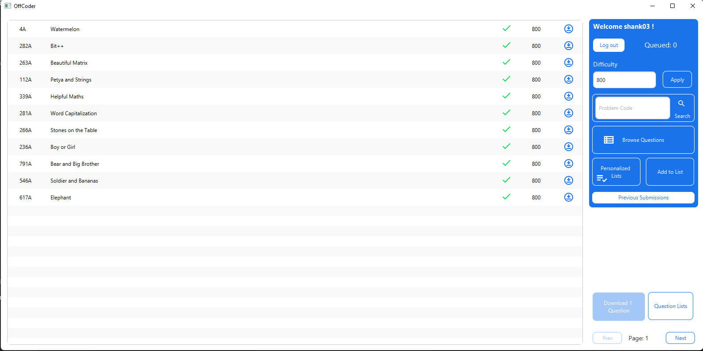

# OffCoder

#### By: Shashank Verma (20204184 - Beese0.25)

### Features
- Users can pick questions from codeforces and search questions using problem code.
- Download problem with it’s test cases.
- Users can submit the code in various languages (like C, C++, Java, Python).
- The platform can compile the code and display the verdict against the sample test case.
- When the user is connected to the internet the platform on its own will submit the user code and give the user a final verdict on its submission.
- Users can make personalized lists for various questions that they have solved with solutions (e.g. ‘My fav DP questions’).
- The platform have a history of submitted questions.

### Get started
```
git clone https://github.com/Beesechurgers/OffCoder.git
```
- Import project in Intellij and you're good to go

## Screenshots of App
<details>
<summary>Click to expand</summary>

 &nbsp;
 &nbsp;
 &nbsp;
 &nbsp;
 &nbsp;
 &nbsp;
 &nbsp;
</details>
