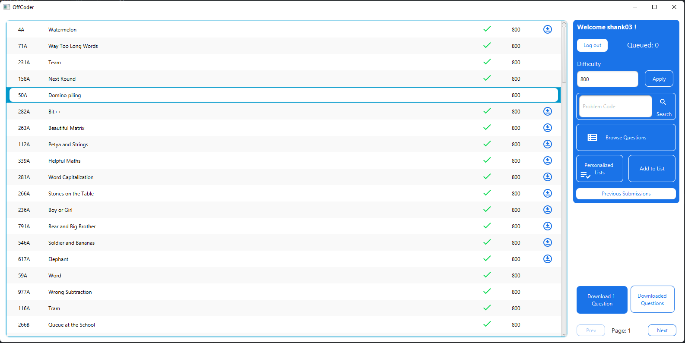
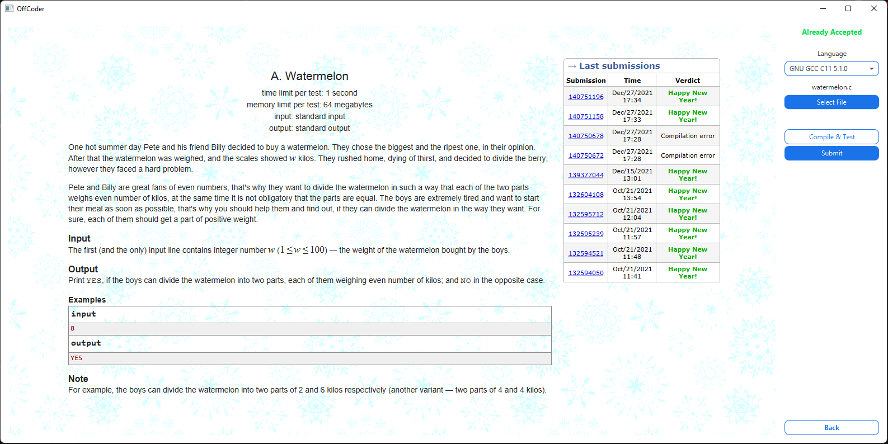
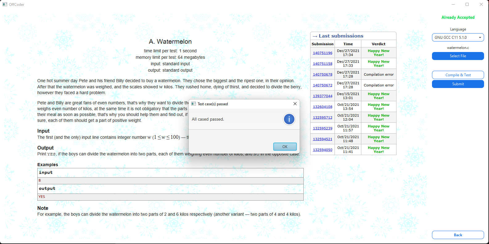
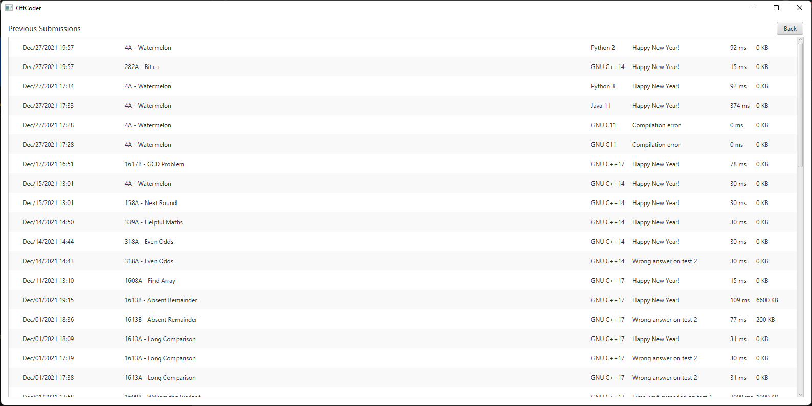
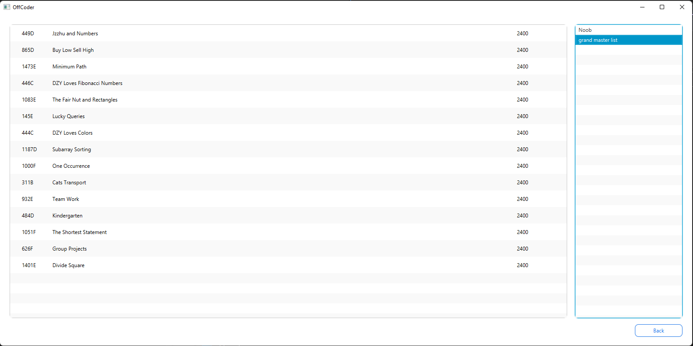
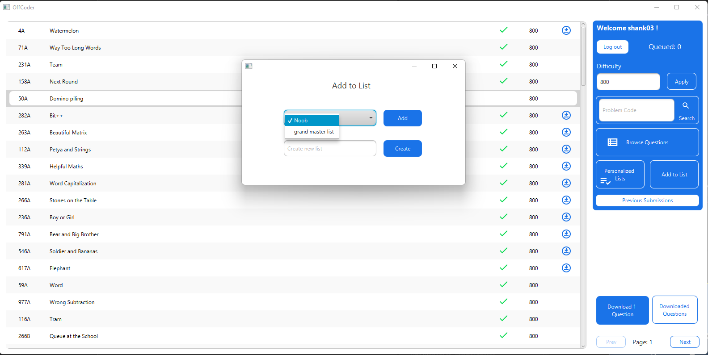

# OffCoder

### Get started
```
git clone https://github.com/Beesechurgers/OffCoder.git
```
- Import project in Intellij you're good to go

## Screenshots of App
<details>
<summary>Click to expand</summary>

 &nbsp;
 &nbsp;
 &nbsp;
 &nbsp;
 &nbsp;
 &nbsp;
 &nbsp;
</details>

By: Shashank Verma (20204184 - Beese0.25)